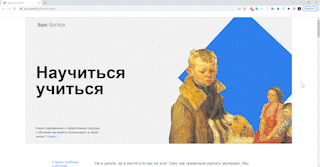

# Научиться учиться
«Научиться учиться» - проектная работа по профессии веб-разработчик [Яндекс Практикум](https://praktikum.yandex.ru "Яндекс Практикум")

## 📌 Описание
Проект состоит из сайта одностраничника, который посвещен теме обучения. В проекте необходимо было применить флексбокс-верстку, позиционирование, навыки работа с анимациями, шрифтами и фреймами.

## ⛏ Стек
- HTML
- CSS

## 🌐 Ссылки
**Ссылка на проект на gh-pages: [how-to-learn](https://alpinaj.github.io/how-to-learn/)**

## 📅 Планы по доработке
- Добавить адатипвную верстку

